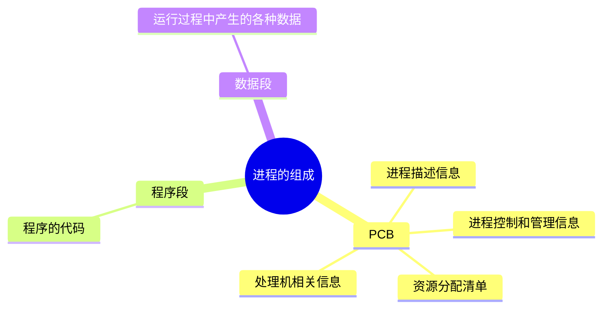
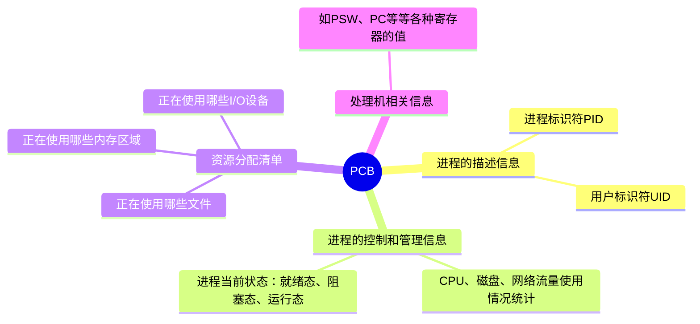
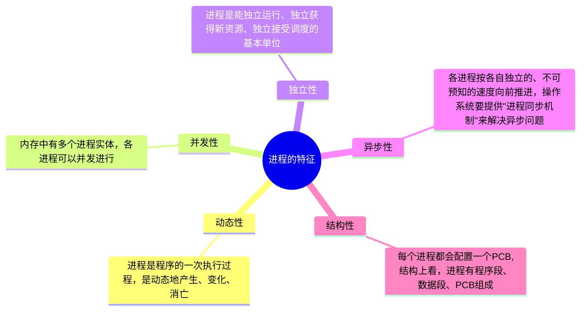
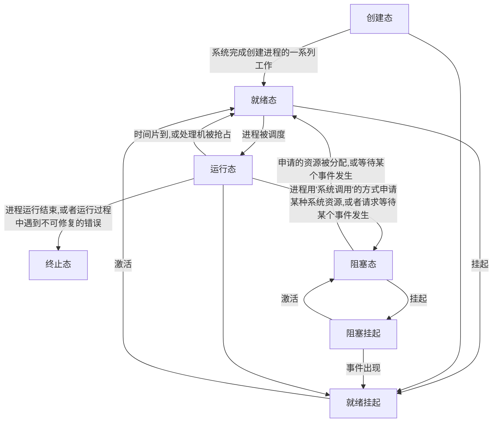
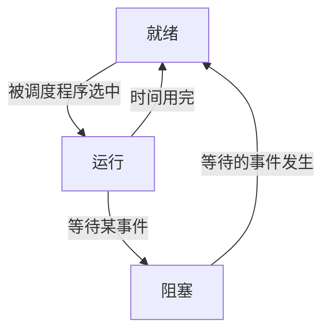

# 进程

## 概念

进程是动态的，是程序的一次执行过程，同一个程序多次执行会对应多个进程

## 组成



程序段、数据段、PCB三部分组成了进程的实体（进程映像）
引入进程实体的概念后，可以把进程定义为：  
进程是进程实体的运行过程，是系统进行资源分配和调度的一个独立单位

> 注意： `PCB是进程存在的唯一标识`

### PCB

当进程被创建时，操作系统会为该进程分配一个**唯一的、不重复**的"身份证号" PID

操作系统要记录PID,进程所属用户ID，还要记录给进程分配了哪些资源、进程的运行情况  
这些信息都被保存在一个数据结构`PCB`,即进程控制块，操作系统需要对各个并发运行的进程进行管理，`但凡管理时所需要的信息，都会被放在PCB中`



## 特征



程序是静态的，进程是动态的，动态性是进程最基本的特征

## 进程的状态



运行态-->到阻塞态是一种进程自身作出的主动行为  
阻塞态-->就绪态是不是进程自身能控制的，是一种被动行为

> 注意:
>
> - 不能由阻塞态直接转换为运行态，也不能由就绪态直接转换为阻塞态(`因为进入阻塞态是进程主动请求的，必然需要进程在运行时才能发出这种请求`)
> - “挂起”和“阻塞”的区别，两种状态都是暂时不能获得CPU的服务，但挂起态是将进程映像调到外存去了，而阻塞态下进程映像还在内存中

### 创建态

进程正在被创建时，它的状态是`创建态`，在这个阶段操作系统会为进程分配资源、初始化PCB

### 就绪态

当进程被创建完成后，便进入`就绪态`，处于就绪态的进程已经具备运行条件，但由于没有空闲CPU,就暂时不能运行

### 运行态

如果一个进程此时在CPU上运行，那么这个进程处于`运行态`

### 阻塞态

在进程运行的过程中，可能会请求等待某个时间的发生(如等待某种系统资源分配，或者等待其他进程的响应)，在这个事件发生之前，进程无法继续往下执行，此时操作系统会让这个进程下CPU,并让他进入`阻塞态`  
当CPU空闲时，又会选择另一个`就绪态`进程上CPU运行

### 终止态

一个进程可以执行exit系统调用，请求操作系统终止该进程，此时该进程会进入`终止态`，操作系统会让该进程下CPU,并回收内存空间等资源，最后还要回收该进程的PCB

## 进程的组织方式

### 链式方式

- 按照进程状态将PCB分为多个队列
- 操作系统持有指向各个队列的指针

### 索引方式

- 根据进程状态的不同，建立几张索引表
- 操作系统持有指向各个索引表的指针

## 进程控制

### 原语

原语是一种特殊的程序，它的执行具有原自行。也就是说这段程序的运行必须一气呵成，不可中断

### 原子性

可以用“关中断指令”和“开中断指令”实现原子性


### 进程控制相关原语

#### 进程创建

1. 创建原语

   - 申请空白PCB
   - 为新进程分配所需资源
   - 初始化PCB
   - 将PCB插入就绪队列 创建态-->就绪态

2. 引起进程创建的事件
   - 用户登录
     - 分时系统中，用户登录成功，系统会为其建立一个新进程
     - 作业调度，多道批处理系统，有新的作业放入内存时，会为其建立一个新的进程
     - 提供服务，用户向操作系统提出某些请求时，会新建一个进程处理该请求
     - 应用请求，由用户进程主动请求创建一个子进程

#### 进程终止

1. 撤销原语

   - 从PCB集合中找到终止进程的PCB
   - 若进程正在运行，立即剥夺CPU,将CPU分配给其他进程
   - 终止其所有子进程
   - 将该进程拥有的所有资源归还给父进程或操作系统

2. 引起进程终止的事件
   - 正常结束
   - 异常结束
   - 外界干预

#### 进程阻塞

1. 进程的阻塞

   - 阻塞原语 运行态-->阻塞态
     - 找到要阻塞的进程对应PCB
     - 保护进程运行现场，将PCB状态信息设置为“阻塞态”，展示停止进程运行
     - 将PCB插入相应事件的等待队列
   - 引起进程阻塞的事件
     - 需要等待系统分配某种资源
     - 需要等待相互合作的其他进程完成工作

2. 进程的唤醒
   - 唤醒原语
     - 在事件等待队列中找到PCB
     - 将PCB从等待队列中移除，设置进程为就绪态
     - 将PCB插入就绪队列，等待被调度
   - 引起进程唤醒的事件
     - 等待事件的发生

#### 进程切换

1. 切换原语
   - 将运行环境信息存入PCB
   - PCB移入相应队列
   - 选择另一个进程执行，并更新其PCB
   - 根据PCB恢复新进程所需的运行环境
2. 引起进程切换的事件
   - 当前进程时间片到
   - 有更高优先级的进程到达
   - 当前进程主动阻塞
   - 当前进程终止

## 进程通信

### 共享存储

- 基于数据结构的共享: 比如共享空间里只能放一个长度为10的数组。这种共享方式速度慢、限制多，是一种**低级通信方式**
- 基于存储区的共享: 操作系统在内存中划出一块共享存储区，数据的形式、存放位置都由通信进程控制，而不是操作系统。这种共享方式速度很快，是一种**高级通信方式**

### 消息通信

- 直接通信方式

消息传送进程要指明接受进程的ID


- 间接通信方式

通过“信箱”间接的通信。


### 管道通信（循环队列）


管道通信和共享存储在于管道通信的读写都是先进先出的

1. 管道只能采用**半双工通信**，某一之间段内只能采用半双工通信，某一时间段内只能实现单向的传输。如果要实现**双向同时通信**，则**需要设置两个管道**

2. 各进程要互斥访问管道（由操作系统实现）

3. 当**管道写满**时，**写进程**将**阻塞**，知道读进程将管道中的数据取走，即可唤醒写进程

4. 当**管道读空**时，**读进程**将**阻塞**，知道写进程往管道写入数据，即可唤醒读进程

5. 管道中的数据一旦被读出，就彻底消失。因此，当多个进程读同一个管道时，可能会错乱。对此，通常有两种解决方案
   1. **一个管道允许多个写进程，一个读进程**
   2. 允许有**多个写进程，多个读进程**，但系统会让各个读进程轮流从管道中读数据(linux)

## 线程

### 线程概念

线程是一个基本的CPU执行单元，也是程序执行流的最小单位

### 属性

- 线程是处理机调度的基本单位
- 多CPU计算机中，各个县城可占用不同的CPU
- 每个线程都有一个线程ID、线程控制块(TCB)
- 线程也有就绪、阻塞、运行三种基本状态
- 线程几乎不拥有系统资源
- 同一进程的不同线程间共享进程的资源
- 由于共享内存地址空间，同一进程中的线程间通信甚至无需系统干预
- 同一进程中的线程切换，不会引起进程切换
- 不同进程中的线程切换，会引起进程切换
- 切换同进程内的线程，系统开销很小
- 切换进程，系统开销比较大

### 实现方式

#### 用户级线程


#### 内核级线程


### 多线程模型

#### 一对一模型

每个用户级线程都对应一个内核级线程

- 优点

  - **提高了并发性**：当一个线程进行阻塞系统调用时，其他线程可以继续执行。
  - **更好的并行性**：在多处理器架构中，多线程可在多核处理机上并行执行。

- 缺点

  - **资源消耗较高**：由于每个用户级线程都需要一个内核级线程来对应，这可能会增加系统的开销和复杂度。

#### 多对一模型

在多线程的多对一模型中，多个用户级线程被映射到一个内核级线程上,且一个进程只被分配一个内核级线程上

- 优点

  - **资源管理效率高**：由于线程管理主要由用户空间的线程库处理，不需要切换到核心态，这使得该模型相对高效。
  - **减少开销**：与一对一模型相比，多对一模型减少了内核级别的上下文切换次数，从而降低了系统开销。

- 缺点

  - **资源竞争严重**：当一个用户级线程进行阻塞系统调用时，所有其他用户级线程都会被阻塞。

#### 多对多模型


### 线程状态与转换



### 线程的组织与控制


## 处理机调度

### 基本概念

调度器通过选择就绪队列中的一个进程并将其分配给CPU来实现这一目标。这使得多个进程能够在有限的硬件资源下并发执行，从而提高系统的整体性能和响应速度

- **分类与层次**：调度可以根据不同的标准进行分类，通常分为三个层次：

  - **高级调度（作业调度）**：决定哪些作业或任务被加载到系统中。
  - **中级调度（内存调度）**：管理进程在主存中的驻留和交换。
  - **低级调度（进程调度或时间片轮转）**：决定当前CPU时间片由哪个进程使用

| 调度类别           | 要做什么                                                             | 发生地               | 发生频率 | 对进程状态的影响                 |
| ------------------ | -------------------------------------------------------------------- | -------------------- | -------- | -------------------------------- |
| 高级调度(作业调度) | 按照某种规则，从后备队列中选择合适的作业将其调入内存，并为其创建进程 | 外存->内存(面向作业) | 最低     | 无->创建态->就绪态               |
| 中级调度(内存调度) | 按照某种规则，从挂起队列中选择合适的进程将其数据回调内存             | 外存->内存(面向进程) | 中等     | 挂起态->就绪态(阻塞挂起->阻塞态) |
| 低级调度(进程调度) | 按照某种规则，从就绪队列中选择一个进程为其分配处理机                 | 内存->CPU            | 最高     | 就绪态->运行态                   |

## 进程调度

进程调度（低级调度）就是按照某种算法从就绪队列中选择一个进程为其分配进程

### 时机

需要进行进程调度与切换的情况

- 当前运行的进程`主动放弃`处理机

  - 进程正常终止
  - 运行过程中发生异常
  - 进程主动请求阻塞

- 当前运行的进程`被动放`弃处理机

  - 分给进程的时间片用完
  - 有更紧急的事需要处理(I/O中断)
  - 有更高优先级的进程进入就绪队列

- 不能进行进程调度与切换情况
  - 在处理中断的过程中
  - 进程在操作系统内核临界区中,但是进程在普通临界区中是可以进行调度、切换的
  - 在原子操作过程中。原子操作不可中断，要一气呵成

## 方式

非剥夺调度方式(非抢占式)

- 一旦某个进程获得了CPU的控制权，它就会一直运行，直到该进程主动放弃CPU（例如，因为等待I/O操作完成或因为进程结束）。在此期间，即使有更高优先级的进程到达，也不会中断当前进程的执行。

剥夺调度式(抢占方式)

- 指操作系统可以在任何时刻中断当前正在运行的进程，并将CPU分配给另一个进程。这种中断通常发生在时间片用完、更高优先级的进程到达或某些特定事件发生时。

## 切换与过程

> 注意  
> 频繁的进程调度、切换会让整个操作系统效率降低，使系统大部分时间都花在进程切换上，属于进程执行的时间减少了

### 切换

“狭义的进程调度”与“进程切换的区别”

- 狭义的进程调度指的是从就绪队列中选中一个要运行的进程
- 进程切换是指一个进程让出处理机，由另一个进程占用处理机的过程

“广义的进程调度”包含了选择一个进程和进程切换两个步骤

### 过程

进程的切换主要完成:

- 对原来运行进程各种数据的保存
- 对新的进程各种数据的恢复

## 调度算法的评价指标

### CPU利用率

$$
{利用率} = \frac{{忙绿时间}}{总时间}
$$

### 系统吞吐量

单位时间内完成的作业数量

$$
{系统吞吐量} = \frac{总共完成了多少道作业}{总共花了多少时间}
$$

### 周转时间

从作业被提交给系统开始，到作业完成为止的这段时间间隔

$$
(作业){周转时间} = {作业完成时间} - {作业提交时间}
$$

$$
{平均周转时间} = \frac{各作业周转时间之和}{作业数}
$$

$$
带权周转时间 = \frac{作业周转时间}{作业实际运行时间} = \frac{作业完成时间 - 作业提交时间}{作业实际运行时间}
$$

> 注意  
> 带权周转时间必然>=1

$$
平均带权周转时间 = \frac{各作业带权周转时间之和}{作业数}
$$

### 响应时间

从用户提交请求到首次产生响应的时间

## 进程同步和互斥

#### 进程同步

同步也叫直接制约关系，是指为完成某种任务而建立的两个或多个进程，这些进程是因为需要在某些位置上协调它们的工作次序而产生的制约关系。进程间的直接制约关系就是源于它们之间的相互合作

#### 进程互斥

我们把`一个时间段内只允许一个进程`使用的资源叫做`临界资源`  
进程互斥是指当一个进程访问某个临界资源时，另一个想要访问该临界资源的进程必须等待。当前访问临界资源的进程访问结束，释放该资源之后，另一个进程才能去访问临界资源

对进程的互斥访问:

- 进入区：负责检查是否可进入临界区，若可进入，则设置"正在访问临界资源标志"
- 临界区：访问临界资源的那段代码
- 退出区：负责解除“正在访问临界资源的标志”（解锁）
- 剩余区：其他处理

> 注意
>
> - 临界区是进程中访问临界资源的代码段
> - 进入区和退出区是负责实现互斥的代码段
> - 临界区可称为"临界段"

为了实现对临界资源的互斥访问，同时保证系统整体性能，需要遵循以下原则:

1. 空闲让进: 临界区空闲时，可以允许一个请求进入临界区的进程立即进入临界区
2. 忙则等待: 当已有进程进入临界区时，其他试图进入临界区的进程必须等待
3. 有限等待: 对请求访问的进程，应保证能在有限时间内进入临界区
4. 让权等待: 当进程不能进入临界区，应立即释放处理机，防止进程忙等待

#### 进程互斥的软件实现方法

##### 单步标志法

单标志法的算法思想是：两个进程在访问完临界区后会把使用临界区的权限转交给另一个进程。也就是说每个进程进入临界区的权限只能被另一个进程赋予。具体实现过程如下：

```c
int turn = 0; //表示当前允许进入临界区的进程号

void P1() {
    while(turn != 0) { // 进入区
        // critical section 临界区
        turn = 1; // 退出区
        // remainder seciont  剩余区
    }
}

void P2() {
    while(turn != 1) {
        // critical section
        turn = 0;
        // remainder seciont
    }
}


```

对于turn表示当前允许进入临界区的进程号，而只有当前允许进入临界区的进程在访问了临界区之后，才会修改turn的值。也就是说，对于临界区的访问，一定是按p0→p1→p0→p1…这样轮流访问。

这种必须轮流访问带来的问题是，如果此时允许进入临界区的进程是P0，而P0一直不访问临界区，那么虽然此时临界区空闲，但是并不允许P1访问。因此对于单标志法，其违背了空闲让进的原则。

##### 双标志先检查法

双标志先检查法的算法思想是：设置一个布尔型数组flag[]，数组中各个元素用来标记各进程想进入临界区的意愿，比如flag[0] = true意味着0号进程p0现在想要进入临界区。每个进程在进入临界区之前先检查当前有没有别的进程想进入临界区，如果没有，则把自身对应的标志flag[i]设为true，之后开始访问临界区。

```c
bool flag[2] = {false, false};

void P1() {
    while(flag[1] );  // 1
    flag[0] = true; // 2
    //critical section // 3
    flag[0] = false; // 4
    //remainder section
}

void P2() {
    while(flag[0]); // 5
    flag[1] = true; // 6
    //critical section // 7
    flag[1] = false; // 8
    //remainder section
}
```

需要注意的是，如果按照152637的顺序执行，p0和p1将会同时访问临界区。因此对于双标志先检查法，其违背了忙则等待的原则。

之所以造成这种问题，就是因为进入区的检查和上锁不是原子操作，在检查完的下一步还没上锁很有可能发生其他事件。

##### 双标志后检查法

双标志后检查法的思想是：既然先检查后上锁不行，那我就先上锁，然后在检查。

```c
bool flag[2] = {false, false};

void P0() {
    flag[0] = true; // 1
    while(flag[1]); // 2
    //critical section // 3
    flag[0] = false; // 4
    //remainder section
}

void P1() {
    flag[1] = true; // 5
    while(flag[0]); // 6
    //critical section // 7
    flag[1] = false; // 8
    //remainder section
}

```

需要注意的是，如果按照1526的顺序执行，p0和p1将都无法进入临界区。

因此双标志后检查法虽然解决了忙则等待的问题，但是又违背了空闲让进和有限等待原则，因为如果各进程都长期无法访问临界资源会产生饥饿现象。

##### Peterson算法

在双标志后检查法中，两个进程都争着想进入临界区，但是谁也不让谁，既然这样，那只需要有人礼让即可解决问题。

```c
bool flag[2] = {false, false};
int turn = 0; // 表示优先让哪个进程进入临界区

void P0() {
    flag[0] = true; // 1
    turn = 1; // 2  可以让对方先进入临界区
    while(flag[1] && turn == 1); // 3
    //critical section // 4
    flag[0] = false; // 5
    //remainder section
}

void P1() {
    flag[1] = true; // 6
    turn = 0; // 7
    while(flag[0] && turn == 0); // 8
    //critical section // 9
    flag[1] = false; // 10
    //remainder section
}
```

如果按照123678的顺序，则相当于串行执行，这种方式肯定可以执行。

如果按照162378的顺序，那么进程0表明自己想进入临界区，进程1表明自己想进入临界区，回到2步骤，0进程表示愿意先让给1进程执行，然后在检查1也有意愿进入临界区和自己已经让位的情况下，自己处于等待状态。这时候回到7步骤，1号进程也表示自己愿意先让给0进程执行，然后在检查0也有意愿进入临界区和自己已经让位的情况下，自己也处于等待状态。此时回到步骤3，0号进程发现turn被修改为0了，说明自己可以不用等待让位了，先行一步作为后回到步骤8，进程P1也顺利做完了。

尽管Peterson算法用软件方法解决了进程互斥问题，遵循了空闲让进、忙则等待、有限等待三个原则，但是依然未遵循让权等待原则。但是相较于前面三种算法，其本身已然是最好

#### 进程互斥的硬件实现方法

##### 中断屏蔽方法

###### 原理

中断屏蔽是指在某个进程或中断处理程序进入临界区之前，暂时禁止系统接收新的中断请求。这样做的目的是确保当前进程在执行临界区代码时不会被其他中断处理程序打断，从而避免并发访问导致的数据不一致问题。


##### TestAndSet指令


优点：

- 实现简单，无需像软件实现方法那样严格检查是否会有逻辑漏洞，适用于多处理机环境

缺点:

- 忙等待：未获取锁的线程会不断循环等待，占用 CPU 资源，影响系统性能。
- 不适合长时间临界区：对于长时间的临界区访问，忙等待会导致 CPU 资源浪费。
- 多处理机环境：在多处理机系统中，TAS 指令只能确保当前处理器上的同步，无法阻止其他处理器上的线程访问共享资源。

##### swap指令


### 互斥锁

一个进程在进入临界区时应获得锁，在推出临界区时释放锁。函数`acquire`获得锁，函数`release`释放锁。

```c
acquire() {
    while (!available);
    available = false;
}
release() {
    available = true;
}
```

> 注意  
> acquire() 和 release() 函数都是原子操作，因此互斥锁通常采用硬件机制实现

特性：

- 优点：

  - 等待期间不用切换进程上下文，多处理器系统中，若上锁的时间短，则等待代价很低

- 缺点：

  - 需忙等，进程时间片用完才下处理机，违反“让权等待”
  - 忙等待： 当有一个进程在临界区中，任何其他进程在进入临界区时必须连续循环调用`acquire()`。当多个进程共享统一CPU时，就浪费了CPU周期。

- 常用于多处理器系统，一个核忙等，其他核照常工作，并快速释放临界区
- 不太适用于但处理机系统，忙等的过程中不可能解锁

### 信号量机制

#### 基本概念

信号量是一个整数值，通常用于表示可用资源的数量。它可以分为两种类型：

- 整型信号量最初Dijkstra把整型信号量定义为一个用于表示资源数目的整型量S，它与一般的整型量不同，除初始化外，仅能通过两个标准原子操作（Atomic Operation）wait(S)和signal(S)操作可以描述为：

```c
int S = 1; // 表示当前系统中可用的资源数

void wait(int S): // wait原语，相当于进入区
    while(S<=0); // 如果资源数不够就循环等待
    S = S - 1; // 如果资源数够，就占用一个资源

void signal (int S): // signal原语，相当于退出区
    S = S + 1; // 使用完资源后，在退出区释放资源

```

- 记录型信号量在整型信号量机制中的wait操作，只要是信号量S<=0,就会不断测试。因此，该机制并未遵循“让权等待”准则，而是使进程处于“忙等”状态。记录型信号量机制则是一种不存在“忙等”现象的进程同步机制。但在采取了“让权等待”的策略后，又会出现多个进程等待访问同一个临界资源的情况。为此，在信号量机制中，除了需要一个用于代表资源数目的整型变量value外，还应该增加一个进程链表指针L，用于链接上述的所有等待进程。记录型信号量是由于它采用了记录型的数据结构而得名的。它所包含的上述两个数据项可以描述为：type semaphore=recordvalue:integerL:list of process;end相应的，wait(S)和signal(S)的操作可描述为

```c
typedef struct {
    int value; // 剩余资源数
    struct process *L; // 等待队列
} semaphore;

void wait(semaphore S) {
    S.value --;
    if(S.value < 0) {
        block(S.L); // 如果资源数量不够，就用block将进程从运行态进入阻塞态，并把挂到信号量S的等待队列中
    }
}


void signal(semaphore S) {
    S.value ++;
    if(S.value <= 0) {
        wakeup(S.L); // 释放资源后，若还有别的进程在等待这种资源，则使用wakeup唤醒等待队列中的一个进程，该进程从阻塞态变为就绪态
    }
}

```

#### 操作机制

信号量机制主要通过两个操作来实现：

- P操作（wait）：
  当进程想要进入临界区时，它会执行P操作，将信号量的值减1。
  如果减1后信号量的值大于或等于0，进程可以继续执行；如果小于0，进程会被阻塞，进入等待队列。

- V操作（signal）：
  当进程离开临界区时，它会执行V操作，将信号量的值加1。
  如果有其他进程在等待该信号量，则其中一个等待的进程将被唤醒。

#### 实现进程互斥


1. **定义信号量**：

   ```c
   semaphore mutex = 1; // 初始化互斥信号量
   ```

2. **进入临界区前的操作（P操作）**：
   在进程要访问临界区之前，必须执行P（wait）操作以请求对资源的访问。这一操作会将信号量的值减1：

   ```c
   P(mutex); // 请求进入临界区
   ```

3. **临界区代码**：
   进程在临界区内执行需要互斥访问的代码。此时，其他进程无法进入该区域。

   ```c
   // 临界区代码段
   ```

4. **离开临界区后的操作（V操作）**：
   当进程完成对共享资源的访问后，必须执行V（signal）操作来释放资源，将信号量的值加1，从而允许其他等待的进程进入临界区：
   ```c
   V(mutex); // 释放临界区
   ```

##### 示例代码

以下是一个简单的示例，展示了如何使用信号量实现进程互斥：

```c
semaphore mutex = 1; // 初始化信号量为1

void process1() {
    P(mutex); // 请求进入临界区
    // 临界区代码段...
    V(mutex); // 离开临界区
}

void process2() {
    P(mutex); // 请求进入临界区
    // 临界区代码段...
    V(mutex); // 离开临界区
}
```

##### 关键点

- **互斥性**：通过将信号量初值设置为1，确保同一时间只能有一个进程进入临界区。
- **阻塞与唤醒**：如果一个进程在执行P操作时发现信号量值为0，则该进程会被阻塞，直到其他进程执行V操作并唤醒它。
- **原子性**：P和V操作通常被实现为原子操作，以防止中断，从而避免竞争条件。

#### 实现进程同步

1. **分析同步需求**：
   确定哪些操作需要同步，即需要保证某些操作按顺序执行。例如，若进程P1的某个操作必须在进程P2的操作之前完成，则需要实现同步。

2. **设置同步信号量**：
   创建一个信号量，初始值设置为0。这个信号量用于控制两个或多个操作之间的顺序。

   ```c
   semaphore sync = 0; // 初始化同步信号量为0
   ```

3. **在“前操作”后执行V操作**：
   在需要确保先执行的操作完成后，调用V操作以释放信号量。

   ```c
   // 前操作代码
   V(sync); // 释放信号量
   ```

4. **在“后操作”前执行P操作**：
   在需要确保后执行的代码之前，调用P操作以请求信号量。如果信号量值为0，则当前进程会被阻塞，直到其他进程释放该信号量。
   ```c
   P(sync); // 请求信号量
   // 后操作代码
   ```

##### 示例代码

以下是一个简单示例，展示如何使用信号量实现两个进程之间的同步：

```c
semaphore sync = 0; // 初始化同步信号量

void process1() {
    // 执行前操作
    // ...
    V(sync); // 完成前操作，释放信号量
}

void process2() {
    P(sync); // 请求信号量，等待process1完成前操作
    // 执行后操作
    // ...
}
```

##### 关键点

- **阻塞与唤醒**：通过设置初始值为0，可以确保在执行后续操作之前，相关进程必须先完成其前置条件。
- **避免竞争条件**：使用信号量可以有效避免由于并发执行导致的数据不一致问题。

通过以上步骤和机制，信号量能够有效地实现进程之间的同步，使得多个并发进程能够按照预定顺序有序地推进。


#### 信号量机制实现前驱关系


信号量机制可以有效地处理进程之间的前驱关系，确保某些操作在其他操作之前完成。以下是信号量如何实现前驱关系的基本原理和步骤。

##### 前驱关系的定义

前驱关系指的是在多个进程或操作中，某个操作的执行必须依赖于另一个操作的完成。例如，如果操作S1必须在操作S2之前完成，则可以表示为S1 -> S2。

##### 实现步骤

1. **设置信号量**：
   为每个需要同步的操作设置一个信号量，初始值为0。这表示该操作在执行之前必须等待其前驱操作完成。
   ```c
   semaphore a1 = 0; // 用于S1 -> S2
   semaphore a2 = 0; // 用于S1 -> S3
   ```

2. **执行前驱操作并释放信号量**：
   在前驱操作（如S1）完成后，调用V操作释放相应的信号量，以通知其他进程可以继续执行。
   ```c
   void S1() {
       // 执行S1的代码
       V(a1); // 通知S2可以执行
       V(a2); // 通知S3可以执行
   }
   ```

3. **在后续操作中请求信号量**：
   在每个后续操作（如S2和S3）开始之前，调用P操作请求相应的信号量。如果信号量值为0，进程将被阻塞，直到前驱操作完成并释放信号量。
   ```c
   void S2() {
       P(a1); // 等待S1完成
       // 执行S2的代码
   }

   void S3() {
       P(a2); // 等待S1完成
       // 执行S3的代码
   }
   ```

4. **继续后续操作**：
   后续操作（如S4、S5、S6等）也可以使用类似的方法进行同步，确保它们在适当的时候执行。

##### 示例代码

以下是一个完整示例，展示了如何使用信号量实现多个进程之间的前驱关系：

```c
semaphore a1 = 0; // S1 -> S2
semaphore a2 = 0; // S1 -> S3
semaphore b1 = 0; // S2 -> S4
semaphore b2 = 0; // S2 -> S5

void S1() {
    // 执行S1的代码
    V(a1); // 通知S2可以执行
    V(a2); // 通知S3可以执行
}

void S2() {
    P(a1); // 等待S1完成
    // 执行S2的代码
    V(b1); // 通知S4可以执行
    V(b2); // 通知S5可以执行
}

void S3() {
    P(a2); // 等待S1完成
    // 执行S3的代码
}

void S4() {
    P(b1); // 等待S2完成
    // 执行S4的代码
}

void S5() {
    P(b2); // 等待S2完成
    // 执行S5的代码
}
```

### 生产者消费者问题


生产者消费者问题是一个经典的进程同步问题，描述了两个进程（生产者和消费者）如何在共享缓冲区中安全地交互。以下是对该问题的详细介绍，包括其背景、问题描述、解决方案及实现方式。

#### 问题描述

在生产者消费者模型中，生产者负责生成数据并将其放入共享缓冲区，而消费者则从缓冲区中取出数据进行消费。关键在于要确保：
- **缓冲区不满**：当缓冲区已满时，生产者必须等待，直到消费者消费了数据。
- **缓冲区不空**：当缓冲区为空时，消费者必须等待，直到生产者生成了数据。

这种模型确保了生产者和消费者之间的协调，避免了数据丢失或错误读取的情况。

#### 解决方案

##### 使用信号量

信号量是一种用于进程间同步的机制，可以有效地解决生产者消费者问题。通常需要使用两个信号量：
- **freeSpace**：表示缓冲区中可用的空位数量。
- **usedSpace**：表示缓冲区中已用的产品数量。

##### 伪代码示例

```c
semaphore freeSpace = N; // N为缓冲区大小
semaphore usedSpace = 0; // 初始时没有产品

void producer() {
    while (true) {
        produceItem(); // 生产一个产品
        P(freeSpace); // 请求一个空位
        putItemIntoBuffer(); // 将产品放入缓冲区
        V(usedSpace); // 增加已用产品计数
    }
}

void consumer() {
    while (true) {
        P(usedSpace); // 请求一个已用产品
        getItemFromBuffer(); // 从缓冲区获取产品
        V(freeSpace); // 增加空位计数
        consumeItem(); // 消费该产品
    }
}
```

##### 使用互斥锁和条件变量

在多生产者和多消费者的情况下，可以使用互斥锁和条件变量来实现更复杂的同步机制。互斥锁用于保护对共享资源的访问，而条件变量则用于在特定条件下阻塞和唤醒线程。

##### 伪代码示例

```c
mutex lock;
condition_variable notFull, notEmpty;
int buffer[N]; // 缓冲区
int count = 0; // 当前产品数量

void producer() {
    while (true) {
        produceItem();
        lock.lock();
        while (count == N) { 
            notFull.wait(lock); // 等待直到有空位
        }
        buffer[count++] = item; // 放入产品
        notEmpty.notify_one(); // 通知消费者有新产品
        lock.unlock();
    }
}

void consumer() {
    while (true) {
        lock.lock();
        while (count == 0) { 
            notEmpty.wait(lock); // 等待直到有产品可消费
        }
        item = buffer[--count]; // 获取产品
        notFull.notify_one(); // 通知生产者有空位
        lock.unlock();
        consumeItem(item);
    }
}
```

##### 总结

生产者消费者问题展示了多线程编程中的同步与互斥的重要性。通过使用信号量、互斥锁和条件变量等机制，可以有效地管理进程之间的协作，确保数据的一致性与完整性。该模型不仅适用于单一生产者和消费者，也可以扩展到多个生产者和消费者的场景中，为并发编程提供了重要的理论基础和实践指导。


### 抽烟者吸烟者问题

吸烟者问题是一个经典的进程同步问题，通常用于教学目的，以展示如何通过信号量和其他同步机制来解决进程间的协调问题。以下是对吸烟者问题的详细介绍，包括其背景、角色、解决方案及实现方式。

#### 问题描述

在吸烟者问题中，有三个抽烟者和一个供应者（商贩）：
- **抽烟者**：每个抽烟者需要三种材料中的任意两种来卷烟。具体来说：
  - 抽烟者1需要烟草和纸。
  - 抽烟者2需要纸和胶水。
  - 抽烟者3需要胶水和烟草。

- **供应者**：负责随机提供这三种材料中的任意两种。

#### 角色关系
- 抽烟者只能在拥有全部三种材料时才能抽烟。
- 供应者每次只放置两种材料，导致某些抽烟者无法抽烟。
- 抽烟者必须等待，直到他们能够获取所需的所有材料。

#### 解决方案

##### 使用信号量

为了解决这个问题，可以使用信号量来管理资源的访问。通常需要以下信号量：
- **mutex**：用于保护对桌子的互斥访问。
- **tobacco**、**paper**、**glue**：分别表示每种材料的可用性。

##### 实现步骤

1. **定义信号量**：
   - 使用一个互斥信号量来保护对桌子的访问。
   - 使用三个信号量分别表示每种材料的可用性。

2. **商贩的行为**：
   - 商贩随机选择两种材料放在桌子上，并通知相应的抽烟者。

3. **抽烟者的行为**：
   - 每个抽烟者在尝试获取材料之前必须等待，直到所需的材料可用。
   - 一旦获取到所有必要的材料，抽烟者就可以制作香烟并进行抽烟。

##### 伪代码示例

```c
semaphore mutex = 1; // 互斥信号量
semaphore tobacco = 0; // 烟草可用
semaphore paper = 0; // 纸可用
semaphore glue = 0; // 胶水可用

void smokerWithTobacco() {
    while (true) {
        P(tobacco); // 等待纸和胶水可用
        // 从桌子上取走纸和胶水，卷烟并抽烟
        V(mutex); // 完成后释放互斥锁
    }
}

void smokerWithPaper() {
    while (true) {
        P(paper); // 等待胶水和烟草可用
        // 从桌子上取走胶水和烟草，卷烟并抽烟
        V(mutex); // 完成后释放互斥锁
    }
}

void smokerWithGlue() {
    while (true) {
        P(glue); // 等待纸和烟草可用
        // 从桌子上取走纸和烟草，卷烟并抽烟
        V(mutex); // 完成后释放互斥锁
    }
}

void vendor() {
    while (true) {
        // 随机选择两种材料放置在桌子上
        if (condition) {
            V(tobacco); // 通知有烟草可用
            V(paper);   // 通知有纸可用
        } else {
            V(glue);    // 通知有胶水可用
            V(paper);   // 通知有纸可用
        }
    }
}
```

##### 实现细节

1. **供应者进程**：供应者不断地放置两种材料，并通过信号量通知相应的抽烟者。
2. **抽烟者进程**：每个抽烟者在尝试获取材料之前必须等待，直到所需的材料可用。一旦获取到所有必要的材料，抽烟者就可以制作香烟并进行抽烟。

