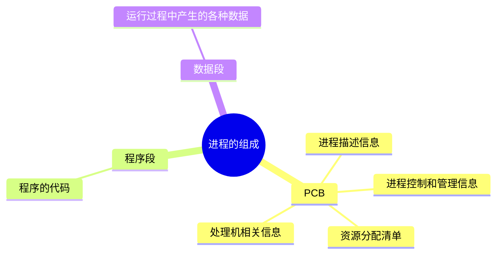
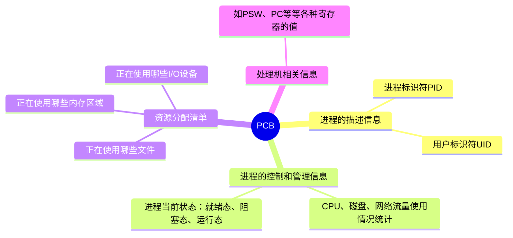
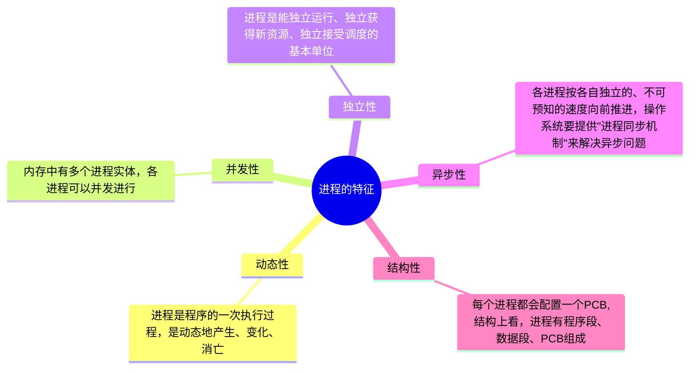
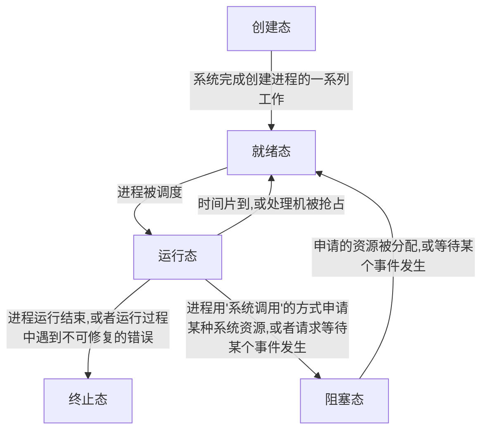

# 进程

## 概念

进程是动态的，是程序的一次执行过程，同一个程序多次执行会对应多个进程

## 组成

程序段、数据段、PCB三部分组成了进程的实体（进程映像）
引入进程实体的概念后，可以把进程定义为：  
进程是进程实体的运行过程，是系统进行资源分配和调度的一个独立单位

注意： `PCB是进程存在的唯一标识`

### PCB

当进程被创建时，操作系统会为该进程分配一个**唯一的、不重复**的"身份证号" PID

操作系统要记录PID,进程所属用户ID，还要记录给进程分配了哪些资源、进程的运行情况  
这些信息都被保存在一个数据结构`PCB`,即进程控制块，操作系统需要对各个并发运行的进程进行管理，`但凡管理时所需要的信息，都会被放在PCB中`

## 特征

程序是静态的，进程是动态的，动态性是进程最基本的特征

## 进程的状态

运行态-->到阻塞态是一种进程自身作出的主动行为  
阻塞态-->就绪态是不是进程自身能控制的，是一种被动行为

注意:  
不能由阻塞态直接转换为运行态，也不能由就绪态直接转换为阻塞态(`因为进入阻塞态是进程主动请求的，必然需要进程在运行时才能发出这种请求`)

### 创建态

进程正在被创建时，它的状态是`创建态`，在这个阶段操作系统会为进程分配资源、初始化PCB

### 就绪态

当进程被创建完成后，便进入`就绪态`，处于就绪态的进程已经具备运行条件，但由于没有空闲CPU,就暂时不能运行

### 运行态

如果一个进程此时在CPU上运行，那么这个进程处于`运行态`

### 阻塞态

在进程运行的过程中，可能会请求等待某个时间的发生(如等待某种系统资源分配，或者等待其他进程的响应)，在这个事件发生之前，进程无法继续往下执行，此时操作系统会让这个进程下CPU,并让他进入`阻塞态`  
当CPU空闲时，又会选择另一个`就绪态`进程上CPU运行

### 终止态

一个进程可以执行exit系统调用，请求操作系统终止该进程，此时该进程会进入`终止态`，操作系统会让该进程下CPU,并回收内存空间等资源，最后还要回收该进程的PCB

## 进程的组织方式

### 链式方式

- 按照进程状态将PCB分为多个队列
- 操作系统持有指向各个队列的指针

### 索引方式

- 根据进程状态的不同，建立几张索引表
- 操作系统持有指向各个索引表的指针

## 进程控制

### 原语

原语是一种特殊的程序，它的执行具有原自行。也就是说这段程序的运行必须一气呵成，不可中断

### 原子性

可以用“关中断指令”和“开中断指令”实现原子性

### 进程控制相关原语

#### 进程创建

1. 创建原语

   - 申请空白PCB
   - 为新进程分配所需资源
   - 初始化PCB
   - 将PCB插入就绪队列 创建态-->就绪态

2. 引起进程创建的事件
   - 用户登录
     - 分时系统中，用户登录成功，系统会为其建立一个新进程
     - 作业调度，多道批处理系统，有新的作业放入内存时，会为其建立一个新的进程
     - 提供服务，用户向操作系统提出某些请求时，会新建一个进程处理该请求
     - 应用请求，由用户进程主动请求创建一个子进程

#### 进程终止

1. 撤销原语

   - 从PCB集合中找到终止进程的PCB
   - 若进程正在运行，立即剥夺CPU,将CPU分配给其他进程
   - 终止其所有子进程
   - 将该进程拥有的所有资源归还给父进程或操作系统

2. 引起进程终止的事件
   - 正常结束
   - 异常结束
   - 外界干预

#### 进程阻塞

1. 进程的阻塞

   - 阻塞原语 运行态-->阻塞态
     - 找到要阻塞的进程对应PCB
     - 保护进程运行现场，将PCB状态信息设置为“阻塞态”，展示停止进程运行
     - 将PCB插入相应事件的等待队列
   - 引起进程阻塞的事件
     - 需要等待系统分配某种资源
     - 需要等待相互合作的其他进程完成工作

2. 进程的唤醒
   - 唤醒原语
     - 在事件等待队列中找到PCB
     - 将PCB从等待队列中移除，设置进程为就绪态
     - 将PCB插入就绪队列，等待被调度
   - 引起进程唤醒的事件
     - 等待事件的发生

#### 进程切换

1. 切换原语
   - 将运行环境信息存入PCB
   - PCB移入相应队列
   - 选择另一个进程执行，并更新其PCB
   - 根据PCB恢复新进程所需的运行环境
2. 引起进程切换的事件
   - 当前进程时间片到
   - 有更高优先级的进程到达
   - 当前进程主动阻塞
   - 当前进程终止
